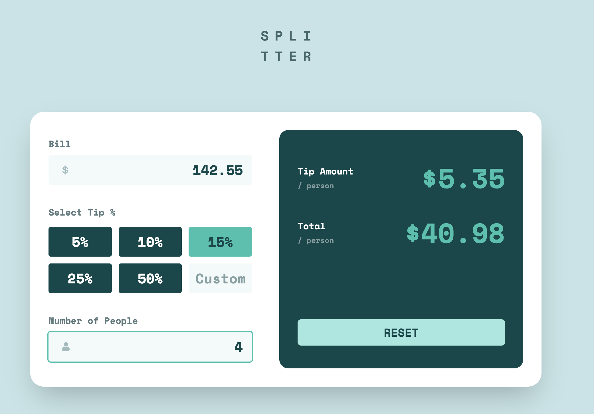

# Frontend Mentor - Tip calculator app solution

This is a solution to the [Tip calculator app challenge on Frontend Mentor](https://www.frontendmentor.io/challenges/tip-calculator-app-ugJNGbJUX). Frontend Mentor challenges help you improve your coding skills by building realistic projects.

## Table of contents

- [Overview](#overview)
  - [The challenge](#the-challenge)
  - [Screenshot](#screenshot)
  - [Links](#links)
- [My process](#my-process)
  - [Built with](#built-with)
  - [What I learned](#what-i-learned)
- [Author](#author)

## Overview

### The challenge

Users should be able to:

- View the optimal layout for the app depending on their device's screen size
- See hover states for all interactive elements on the page
- Calculate the correct tip and total cost of the bill per person

### Screenshot



### Links

- Solution URL: [GitHub repository](https://github.com/samulikn/tip-calculator-app)
- Live Site URL: [Live site](https://samulikn.github.io/tip-calculator-app)

## My process

### Built with

- Semantic HTML5 markup
- [Tailwind CSS](https://tailwindcss.com/)
- Flexbox
- CSS Grid
- Mobile-first workflow
- [TypeScript](https://www.typescriptlang.org/)

### What I learned

For the first time, I used the semantic <output> element to display calculated values. Also, instead of repeating styling classes on multiple child elements, I applied Tailwind utility classes to parent containers. This allowed child components to inherit layout and design rules automatically that reduced code duplication and improved maintainability.

For example:

```html
<div
            class="[&_label]:text-2xl/9 [&_label]:w-auto [&_label]:px-4 [&_label]:text-center [&_label]:cursor-pointer 
                [&_label]:hover:text-green-900 [&_label]:has-checked:bg-green-400">
            <label for="tip5"><input id="tip5" type="radio" name="tip-amount" value="5"
                class="tip-fixed hidden" />5%</label>
            <label for="tip10"><input id="tip10" type="radio" name="tip-amount" value="10"
                class="tip-fixed hidden" />10%</label>
```

## Author

- Website - [Nataliia](https://natashobotova.onrender.com)
- Frontend Mentor - [@samulikn](https://www.frontendmentor.io/profile/samulikn)
